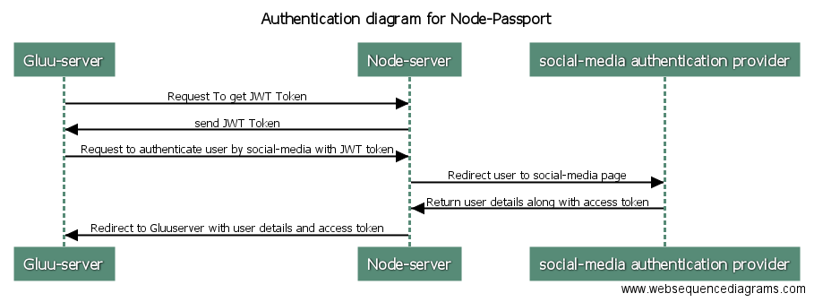
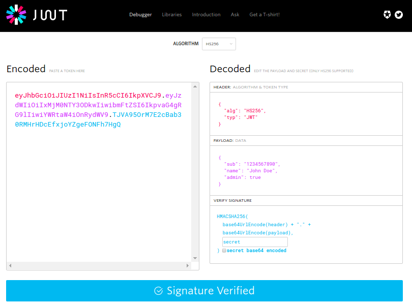

# Node-Passport Social Auth

## OVERVIEW

Node-Passport Auth is a project for authenticating all the social media providers from only one server which will be used by Gluu server for authenticating users to all social networks.

## GOALS

- To create Node-Passport server which will provide social network authentication APIs for Gluu server.
- To create Gluu server interception scripts for authentication of users which will consume Node-Passport server api.

## SPECIFICATIONS

Node-Passport server authenticates users for all the social networks like: google+, facebook, twitter etc. Node-Passport uses passport authentication middleware for social network authentication. All the node js api are secured with JWT(JSON Web Token) so that all the requests to node js server are authenticated and can be trusted by the application.

Gluu server has only one interception script for all the social network providers which will call node js server for authenticating users to respective social network provider. The users will be added to Gluu server if the user does not present in the LDAP server of Gluu and if user does not exists then user will be added to server.

## Sequence Diagram:

1. Gluu server calls Node-Passport server for JWT token.
2. Node-Passport server generates a JWT token and provides it in response to Gluu server.
3. Gluu server requests Node-Passport server with JWT token to authenticate user for a social network provider.
4. Node-Passport server will redirect user to social media authentication provider.
5. After successful authentication of user, social network will callback Node-Passport server along with user details and access token.
6. Node-Passport server will redirect user back to Gluu server with user details and access token.
7. Gluu server’s interception script will check if the user exists in LDAP server and if user exists then user will be logged into the system and if not, then it will create new user with the required details and logs user into the system.

## JWT:

JSON Web Token (JWT) is an open standard (RFC 7519) that defines a compact and self-contained way for securely transmitting information between parties as a JSON object. This information can be verified and trusted because it is digitally signed. JWTs can be signed using a secret (with HMAC algorithm) or a public/private key pair using RSA.

JSON Web Tokens consist of three parts separated by dots (.), which are:
- Header
- Payload
- Signature

Therefore, a JWT typically looks like the following.
xxxxx.yyyyy.zzzzz

All the three parts are then Base64Url encoded to form JSON Web Token. 

The output is three Base64 strings separated by dots that can be easily passed in HTML and HTTP environments, while being more compact compared to XML-based standards such as SAML.

The following shows a JWT that has the previous header and payload encoded, and it is signed with a secret. 

If you want to play with JWT and put these concepts to practice, you can use jwt.io Debugger to decode, verify and generate JWTs.

## Example of encoded and decoded JWT

Whenever the user wants to access a protected route or resource, it should send the JWT, here in our case in route url. Therefore the route or api call should look like the following.

https://urltorouteorresource/JWT

This is a stateless authentication mechanism as the user state is never saved in the server memory. The server's protected routes will check for a valid JWT in the API parameter, and if there is a valid token, the user will be allowed.

## What data will be persist?

All the data that are received from the social network like name, email etc will be stored. If all the required details for creating a user are not available from the social network then user will be asked to enter all the required details.

## How Node-Passport server will fit in Gluu server?

During the installation of Gluu server we can setup node server as well. We can create a vagrant script to set up whole Node-Passport environment.

## How does Gluu server specify which passport strategy it wants?

There will be single page for the authentication with different buttons which will call different endpoints on Node-Passport server. For example twitter button will call the twitter strategy of Node-Passport server for twitter authentication.

## How Node-Passport server will fit in Gluu server?

We can write some commands or script to install Node-Passport server which can be added to Gluu server dpkg so that during installation of gluu server, Node-Passport server will be installed as well. And to start Node-Passport server we can start Node-Passport server with gluu server itself.

## How Node-Passport server will be configured?

For configuring the application secret and application Id we can create a UI to take user's credentials of their respective social network application.

## What are the requirements for a Node-Passport server?

Requirements for Node-Passport server is just Node js and project dependencies which can be installed by moving to project directory and executing command (npm install).

#Gluu APIs For Configuration of Node-Passport Server

##Client application credentials

This API returns application ID,Secret and return URL (callback URL) of a sso provider.

###Request
| Method        | URL           |
| ------------- |:-------------:|
| POST      | /apiURL |

| Type        | Params           | Param type           |
| ------------- |:-------------:| ------------- |
| POST      | provider | string |

Here provider is a string value representing an sso example: twitter, gplus, facebook.

| Example request        |
| ------------- |
| { "provider": "twitter"}       |

###Response
| Status        | Response           |
| ------------- |:-------------:|
| 200      | { "consumerKey" : "consumerKey", "consumerSecret": "consumerSecret", "callbackURL": "CallbackURL" } |
